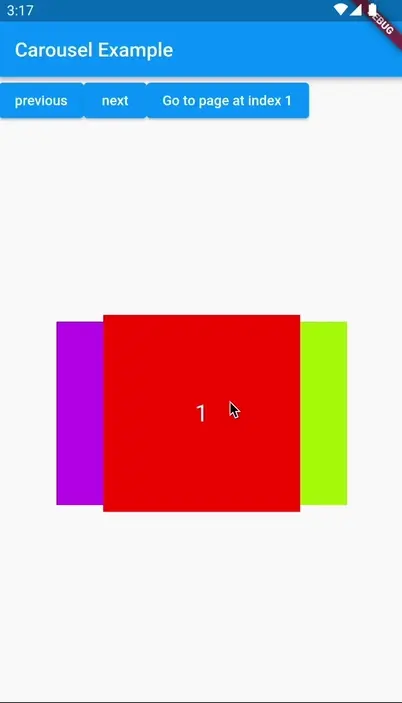
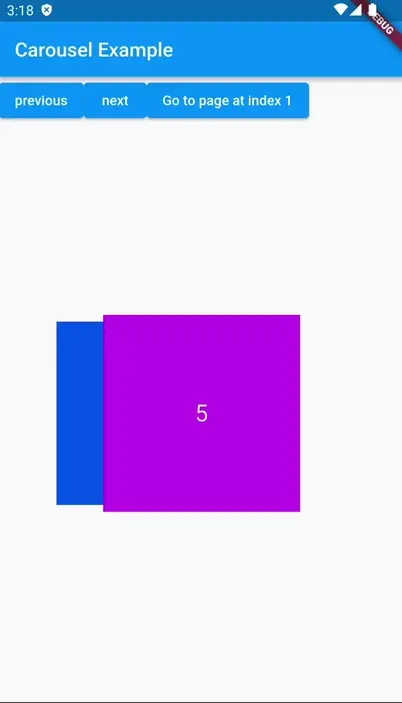
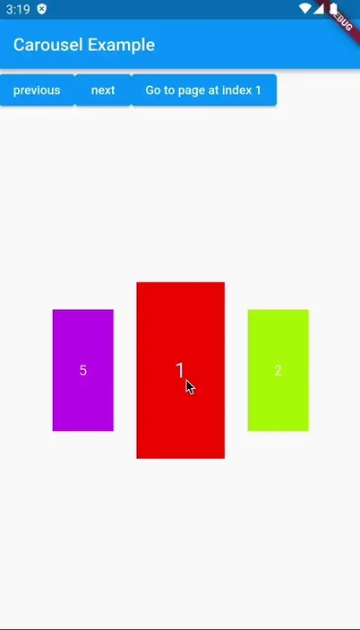

# Carousel3D

A carousel that rotates item in 3D

## Features
 - Infinite scroll
 - Custom child widgets

## Supported platforms
 - Flutter Android
 - Flutter iOS
 - Flutter web
 - Flutter desktop


## Installation

Add `carousel_3d: <latest>` to your `pubspec.yaml` dependencies. And import it:

```dart
import 'package:carousel_3d/carousel_3d.dart';
```

## Getting started

Simply create a `Carousel3D` widget, and pass the required params:

```dart
SizedBox(
    height: 200,
    width: 300,
    child: Carousel3D(
        controller: controller,
        maxHorizontalShift: 50,
        infiniteScroll: true,
        itemCount: 5,
        minScaleFactor: 0.8,
        itemBuilder: (index, z) {
            return Container(
                color: [Colors.red,Colors.blue,Colors.green, Colors.orange, Colors.pink].toColor(),
                child: Center(
                    child: Text(
                            '${index + 1}',
                            style: const TextStyle(
                            fontSize: 24,
                            color: Colors.white,
                        ),
                    ),
                ),
            );
        },
    ),
)      
```

## Params

```dart
Carousel3D(
    itemBuilder: (index, z) {
        return Container(
            color: [Colors.red,Colors.blue,Colors.green, Colors.orange, Colors.pink].toColor(),
            child: Center(
                child: Text(
                        '${index + 1}',
                        style: const TextStyle(
                        fontSize: 24,
                        color: Colors.white,
                    ),
                ),
            ),
        );
    },
    itemCount: 5,
    startIndex: 0,
    controller: Carousel3DController(),
    infiniteScroll: true,
    maxHorizontalShift: 50,
    minScaleFactor: 0.5,
 )
```

| Parameter  | Description | required | default|
| ----------- | ----------- | ----------- | ----------- |
| itemBuilder | Delegate called for each item, first parameter is index, and second is items position on z axis (0 to 1) | true |   |
| itemCount   | items count of carousel | true |   |
| startIndex | start index of carousel | false | 0 |
| infiniteScroll | is carousel infinite scrollable | false | true |
| maxHorizontalShift | maximum width of items visible on each side | false | 50 |
| minScaleFactor | minimum scale of item when it's on back | false | 0.5 |
| controller | Carousel controller to control carousel externally | false | null |


## Controller

A `Carousel3DController` can be passed in `controller` parameter. It can be used to control carousel manually.

```dart
class Carousel3DDemo extends StatelessWidget {
  Carousel3DController controller = Carousel3DController();

 @override
  Widget build(BuildContext context) => Column(
    children: <Widget>[
        SizedBox(
            height: 200,
            width: 300,
            child: Carousel3D(
                controller: controller,
                maxHorizontalShift: 50,
                infiniteScroll: true,
                itemCount: 5,
                minScaleFactor: 0.8,
                itemBuilder: (index, z) {
                    return Container(
                        color: [Colors.red,Colors.blue,Colors.green, Colors.orange, Colors.pink].toColor(),
                        child: Center(
                            child: Text(
                                    '${index + 1}',
                                    style: const TextStyle(
                                    fontSize: 24,
                                    color: Colors.white,
                                ),
                            ),
                        ),
                    );
                },
            ),
        ),
        RaisedButton(
            onPressed: () => controller.nextPage(),
            child: Text('Next'),
        )
    ]
  );
}
```

`Carousel3DController` methods

`Future nextPage({Curve curve = Curves.easeOut})`

Animates carousel to next Page


`Future previousPage({Curve curve = Curves.easeOut})`

Animates carousel to previous Page


`jumpToPage(int index)`

jumps to page with given index


`Future animateToPage(int index, {Curve curve = Curves.easeOut})`

Animates carousel to page with given index

## Screenshots

Basic infinite scroll example




Basic non infinite scroll example




Carousel with different `minScaleFactor` and `maxHorizontalShift`

